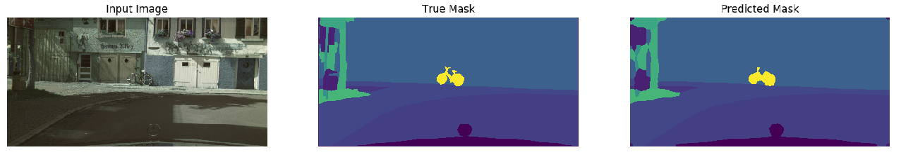
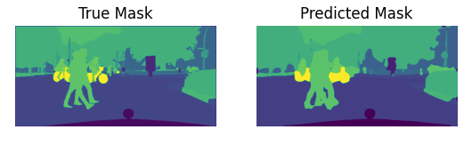

# PSPNet Implementation in Tensorflow
This repository contains an implementation of [PSPNet](https://hszhao.github.io/projects/pspnet/) in Tensorflow 2.1, as part of a project for DD2424 Deep Learning in Data Science at KTH Royal Institute of Technology. 

*The code was written in a pair-programming fashion using screensharing on Discord. As such, all project members contributed to most of the commits.*

## Example: Overfit Test
The following is the output from an overfit test of 60 epochs, by training on a single image 
repeatedly.

## Example: After 60 Epochs of Training
The following image is from an output taken after training on 50% of the high-quality annotated examples 
on Cityscapes.

*Note: The following image is a randomly chosen image from the training dataset.*

